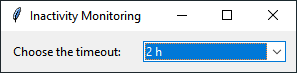

# Idle-Sleep-Manager 💤
Python-based application to enforce system sleep after a set period of user inactivity, even when video players or streaming services prevent it.

[**Download the latest version here**](https://github.com/cfrBernard/Idle-Sleep-Manager/releases)


<br>
<br>

<p align="center">
  
</p>

<br>

## Features

- **Customizable timeout**: Choose from predefined durations (e.g., 5 minutes, 15 minutes, 1 hour, etc.).
- **Cross-platform support**:
  - **Windows**: Uses `rundll32.exe` to trigger sleep mode.
  - **Linux/MacOS**: (Commands included but commented out).
- **User-friendly GUI**: Built with `Tkinter` for an intuitive interface.
- **Event monitoring**: Listens to keyboard and mouse activity using `pynput`.

---

## 🛠 Development Setup

### Installation:
1. **Clone the repository**:
   ```bash
   git clone https://github.com/cfrBernard/Idle-Sleep-Manager.git
   cd Idle-Sleep-Manager

2. **Install dependencies**:
   ```bash
   pip install pynput

### Usage:

1. **Run the script**:
   ```bash
   python app.py

2. **Set timeout**:
  - Select the desired inactivity period from the dropdown menu.
  - The script will begin monitoring your activity automatically.

3. **Sleep trigger**:
  - Once the defined inactivity time is exceeded, the system will go to sleep.

## 📌 Notes

**Permissions**:
- Administrator privileges may be required for the sleep command on Windows.
- On Linux/MacOS, uncomment the respective systemctl or pmset command for sleep functionality.

**Custom configurations**:
- You can adjust the default timeout (timeout) or add more options in the dropdown.

---

## 📜 License: 
This project is licensed under the MIT License. See the [LICENSE](./LICENSE.md) file for details.
